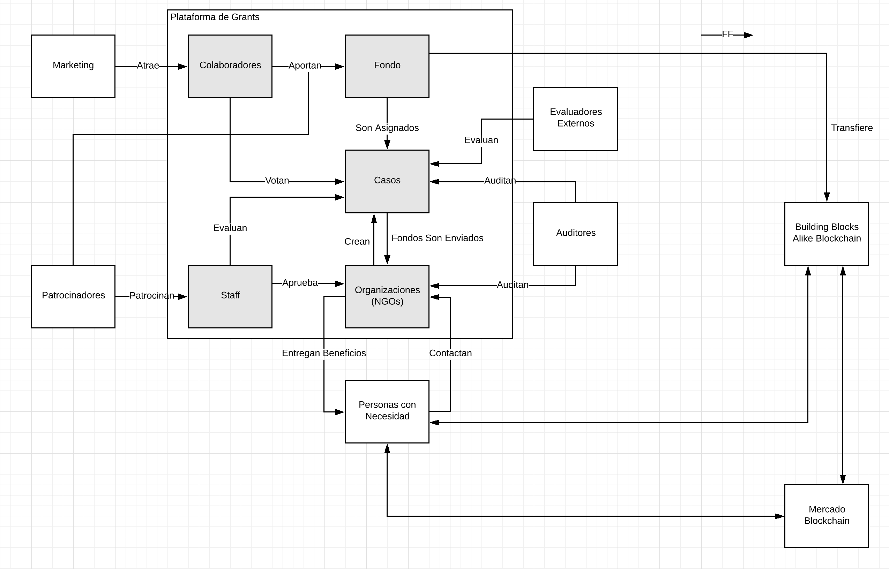

# Plataforma pública de ayuda humanitaria

La intención de este proyecto es implementar una plataforma de
concentración y amplificación de esfuerzos para canalizar ayuda a
personas que no pueden cubrir por sus propios medios las necesidades
más básicas para la vida, así como fomentar proyectos de caracter
social que ayuden a paliar este tipo de situaciones en el lugar.

## Motivación

A partir del deterioro constante de las condiciones de vida de los
habitantes de Venezuela en los últimos años, muchas personas, ante la
imposibilidad de cubrir sus necesidades
básicas por medios propios, han comenzado a acudir ante fundaciones,
asociaciones, organizaciones no gubernamentales (ONGs), grupos religiosos, entre otros, para solicitar
ayuda.

Por otro lado, la inmensa diáspora de venezolanos en los últimos años
ha comenzado a establecer en cierto grado comunidades y grupos en
ciudades de todo el mundo. Desde estas comunidades se han gestado
iniciativas enfocadas en la recolección de recursos, principalmente de
carácter médico, para luego enviarlos a Venezuela y donarlos a
las personas que los necesitan.

En otros casos, algunas personas que se encuentran en condiciones
delicadas de salud, necesitando de tratamientos y/o intervenciones
quirúrgicas de mayor costo, los cuales en muchos casos no
se pueden atender dentro del país debido al deterioro de los servicios
médicos, han acudido a plataformas de _CrowdFunding_, con la esperanza
de reunir recursos económicos que les permitan viajar al exterior para
realizarse una cirugía, o adquirir los equipos y materiales que
necesitan para realizar estos tratamientos en el país, desde el
exterior.

Sin embargo, diversos factores no han permitido que, sean los grupos
formados por voluntarios en la diáspora, o sean las campañas de
recolección directa de fondos, tengan el impacto o nivel de éxito
esperado.

Esta iniciativa nace con la intención de mitigar el efecto de algunos
de los factores principales que han ocasionado que las iniciativas
actuales no generen los resultados esperados:

- Visibilidad: personas con la capacidad de brindar
  apoyo no tienen visibilidad de las situaciones que su colaboración
  podría impactar de manera positiva.
- Confianza:
  - Fraudes: lamentablemente, personas sin escrúpulos han
    utilizado esta situación para esconderse detrás de iniciativas de
    este tipo para obtener donaciones en línea y fuera de línea,
    reuniendo recursos para su propio beneficio y defraudando a los
    colaboradores.
  - Transparencia y retroalimentación: la falta de transparencia en
    las actividades de organizaciones y/o individuales, así como
    la ausencia de evidencias del impacto del soporte que se brinda,
    hace que muchas personas dispuestas a colaborar se abstengan.
  - Obstáculos logísticos: la colocación contínua de obstáculos para el
    ingreso de ayuda en el país, tanto a través de canales financieros
    como a través de puertos y aduanas, afecta también la confianza a la
    hora de brindar apoyo, debido a que existen pocas garantías de que
    este apoyo llegue a sus beneficiarios finales.
- Conveniencia: personas que aún ignorando los factores 
  anteriores desean colaborar, encuentran dificultades para hacerlo
  debido a carencias de tiempo, complejidad de las plataformasxs
  existentes o por falta de claridad sobre como colaborar.
- Calidad del apoyo: en campañas de recolección de equipos y
  materiales, los mismos muchas veces son redundantes, no orientados a
  las necesidades reales, o sencillamente no de la calidad esperada.
- Iniciativas locales sin apoyo: existen iniciativas in situ, que
  aunque no puedan solucionar todos los problemas por sí solas, pueden
  afectar de manera positiva la vida de sus comunidades, fomentando la
  autogestión y mejorando la calidad de vida. Estas iniciativas pasan
  desapercibidas y no consiguen el apoyo que necesitan para realizar
  sus proyectos.

Mientras que todas estas situaciones parecen muy específicas a la
situación actual de Venezuela, se pueden observar condiciones
similares casi en cada uno de los casos en que existen situaciones de
emergencia humanitaria en todo el mundo, por lo que no se descarta que
este proyecto pueda atender casos fuera del territorio venezolano.

## Objetivo general

Implementar una plataforma que reuna el apoyo para iniciativas de
caracter humanitario y social, que amplifique la visibilidad de las
necesidades, ofrezca confianza y conveniencia a los colaboradores y
mejore la calidad del impacto obtenido.

## Objetivos específicos

- Hacer uso de técnicas de mercadeo digital para aumentar la
  visibilidad de las necesidades humanitarias.
- Servir como concentrador de apoyo con un sistema completamente
  público y transparente de seguimiento del apoyo monetario en un
  fondo o *pote* centralizado.
- Ofrecer un sistema abierto de evaluación de casos, así como de
  asignación de beneficios desde el *pote*.
- Establecer asociaciones estratégicas con organizaciones, ONGs y
  asociaciones civiles para la creación y documentación de casos en la
  plataforma, así como la canalización logística de las asignaciones
  de apoyo hasta sus beneficiarios finales.
- Establecer asociaciones con entes públicos y privados que patrocinen
  tanto la alimentación del fondo de apoyo, o *pote*, como la
  operación y necesidades de la plataforma.
- Explorar el uso de la tecnología para reducir los riesgos y eliminar
  intermediarios en la cadena de ayuda.

## Hoja de Ruta

* Crear y mantener un listado público de *organizaciones*,
  asociaciones y grupos en general dedicados a la recolección de
  recursos y su envío a Venezuela para paliar necesidades de carácter
  humanitario, que estén verificadas y que den garantías de seriedad
* Mantener, en conjunto con las organizaciones presentes en la
  plataforma, un listado de *casos* de necesidades humanitarias que
  pueden ser resueltas con bienes físicos y permitir que las
  organizaciones detrás de cada caso puedan ser contactadas y
  coordinar la entrega de los mismos a través de la plataforma
* Implementar una campaña permanente de reclutamiento de *voluntarios*
  dedicados a la evaluación y seguimiento de casos y organizaciones
* Diseñar e implementar una campaña permanente de *mercadeo digital*
  para dar visibilidad a los *casos* y *organizaciones* presentes en
  la plataforma y atraer colaboradores
* Implementar un *fondo* al que los *colaboradores* puedan suscribirse
  para realizar donaciones en dinero, ya sean recurrentes o
  una sola vez, que permita canalizar recursos hacia las fundaciones
  para la compra de materiales y equipos para atender necesidades
  humanitarias.
* Implementar un sistema público de verificación, priorización y
  *otorgamiento* de beneficios desde el *fondo* a *casos*
  específicos. Véase [Fluxx] como inspiración.
* Dar la posibilidad a *colaboradores* registrados de *votar* por
  casos de su interés, utilizando un sistema de votación inspirado en
  [Condorcet], sobre un conjunto de casos verificados en rotación
  permanente y con un grado garantizado de diversidad, como
  complemento al sistema de verificación, con el objetivo de reducir
  la concentración de otorgamientos en una muestra de casos de
  características constantes.
* Abrir la plataforma a entidades no individuales que quieran fungir
  como *patrocinadores* realizando aportes al *fondo*, así como al
  mantenimiento y promoción de la misma.

### Futuro

* Permitir la asignación directa de recursos a los beneficiarios
  finales en un sistema de intercambio digital. Véase [Building
  Blocks]

## Diagrama

## Referencias

- [Help4Venezuela](https://github.com/dynarro/help4venezuela)
- [Fluxx](https://www.fluxx.io/)
- [Building Blocks](https://innovation.wfp.org/project/building-blocks/)
- [Condorcet](https://es.wikipedia.org/wiki/M%C3%A9todo_de_Condorcet)
